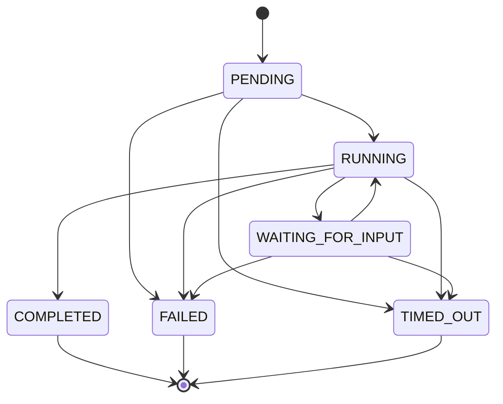

# Nexus Day 1 Report - Contracts and State Machine

## 1. ADR 001: Message Broker Selection

NATS was selected over Redpanda because Nexus is dominated by agent coordination rather than log-centric streaming. The key workflows are request-reply, acknowledgement, retries, and human-in-the-loop pauses. NATS plus JetStream maps naturally to that shape while keeping the local and production operational model simple.

See [ADR 001](adr/001-message-broker-selection.md) for the full justification.

## 2. Workflow Graph Schema

The workflow graph is defined in [schemas/workflow-graph.schema.json](../schemas/workflow-graph.schema.json). It models:

- Nodes as agents or terminal states.
- Edges as typed transitions with conditions.
- A required entry node.
- A list of terminal node identifiers.

Static safety is split into two layers:

- JSON Schema validates the structural shape.
- The Python validator in [src/nexus/workflow_validation.py](../src/nexus/workflow_validation.py) rejects cycles, unreachable nodes, missing endpoints, and terminal-node violations before execution starts.

### Example Workflow

The intended product-shaped workflow is an automated research pipeline:

1. Planner creates a task decomposition.
2. Researcher gathers sources and evidence.
3. Writer composes the draft answer.
4. Verifier checks factual consistency.
5. Terminal node completes the execution or routes to human review when needed.

## 3. Workflow Execution State Machine

Execution states are defined in [schemas/workflow-execution.schema.json](../schemas/workflow-execution.schema.json): `PENDING`, `RUNNING`, `WAITING_FOR_INPUT`, `COMPLETED`, `FAILED`, and `TIMED_OUT`.

### Crash Recovery Strategy

Recovery is based on durable execution records, not in-memory state.

- PostgreSQL stores the authoritative execution row, including `state`, `current_node_id`, `last_committed_node_id`, `version`, and heartbeat metadata.
- Redis is used only for short-lived lease and lock coordination.
- On restart, the reconciler scans for executions in `RUNNING` or `WAITING_FOR_INPUT` whose heartbeat has expired.
- A record in `RUNNING` is not confused with `PENDING` because `PENDING` only exists before the first durable transition is committed.
- Resume always starts from the last committed node, which makes retries idempotent and crash-safe.

## 4. Inter-Agent Messaging Contract

The message envelope is defined in [schemas/inter-agent-message.schema.json](../schemas/inter-agent-message.schema.json). It includes:

- `message_id` for unique delivery tracking.
- `correlation_id` for end-to-end tracing.
- `parent_span_id` for trace hierarchy.
- `payload_schema_ref` so payloads are typed, not free-form.
- `timestamp` for ordering and auditability.
- `sender_agent_id` and `recipient_agent_id` for explicit routing.
- `idempotency_key` for deduplication on retries.

### Idempotency Model

Consumers must treat `(sender_agent_id, recipient_agent_id, idempotency_key)` as the deduplication key. If the same message arrives twice because of a network retry or consumer replay, the second copy is ignored after the first successful commit.

## 5. Infrastructure Base

The base environment is defined in [docker-compose.yml](../docker-compose.yml).

- PostgreSQL provides durable workflow state and audit history.
- Redis provides distributed locks, short-lived leases, and cached execution state.
- NATS provides low-latency request-reply coordination and JetStream durability.

Healthchecks are included for all services so the stack can be started and verified locally with `make up`.
